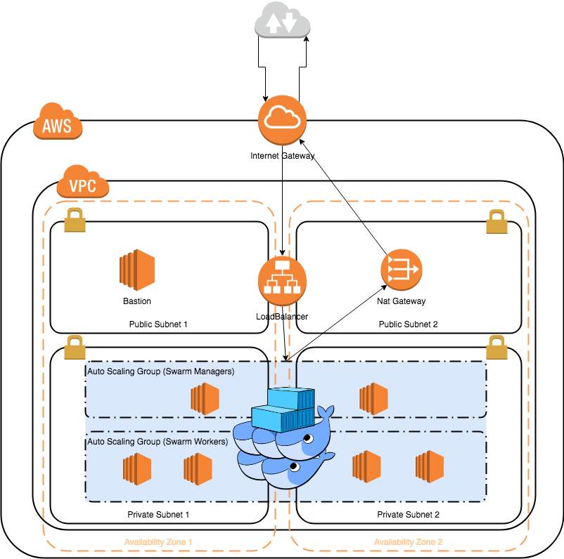

# TerracidTango
Terraform Template for AWS Infraestructure

# Overview

This template deploys a VPC accross two availability zones in the region specified (`eu-west-1` is
the default region). For each AZ there is a private and a public subnet. There is one Bastion Host
in the first public subnet to access the instances in the private subnets. There are two `t2.micro`
instances deployed, one in each private subnet, running [RancherOS 1.5](https://rancher.com/rancher-os/).
Finally, all the network plumbing and an Application Load Balancer are deployed to route the traffic
to http port 80 to the EC2 instances.

## Architecture Overview



# Setup

## Dependencies

- AWS Credentials File ([link](https://docs.aws.amazon.com/cli/latest/userguide/cli-configure-files.html))
- terraform ([link](https://www.terraform.io/downloads.html))
- Create a ssh-key in your AWS account

For more info on how Terraform works visit the [Getting Starte Guide](https://learn.hashicorp.com/terraform/getting-started/install.html)
and the [Docs](https://www.terraform.io/docs). For more specific information about AWS resources
go to the [AWS Provider Documentation](https://www.terraform.io/docs/providers/aws/index.html).

## Usage

Clone the repository

```sh
git clone git@github.com:acidtango/terracid_tango.git
```

Rename the `terraform.tfvars.example` file to be `terraform.tfvars`:

```sh
mv terraform.tfvars.example terraform.tfvars
```

Modify the file to use your specific credentials:

```
# File where your AWS credentials are stored
aws_credentials_file = "~/.aws/credentials"

# SSH key pair used to create the EC2 instances.
aws_key_name = "your-aws-key"

# AWS CLI profile to use. Defaults to 'default'.
aws_cli_profile = "your-profile"
```

Initialize terraform
```
$ terraform init
```

If everything is correct the following command should output an execution plan
```
$ terraform plan
```

To create the infraestructure
```
$ terraform apply
```

To reverse everything
```
$ terraform destroy
```

## Testing your deployment

If the `terraform apply` command completes succesfully, it will output the DNS Address of the Load
Balancer
```
$ terraform apply
...

Apply complete! Resources: 0 added, 0 changed, 0 destroyed.

Outputs:

  alb_dns_name = some.dns.name
```

To test the infrastructure, connect through the bastion host into the EC2 instances in the private
network and deploy any service that responds in the port 80. With the RancherOS instances you could
run an [echo server](https://hub.docker.com/r/inanimate/echo-server)

```
$ docker run -d -p 80:8080 inanimate/echo-server
```

Once that is done make an HTTP request to the Load Balancer Address. The response should be something
similar to this
```
$ curl some.dns.name

Welcome to echo-server!  Here's what I know.
  > Head to /ws for interactive websocket echo!

-> My hostname is: echo-server-4282639374-6bvzg

-> My Pod Name is: echo-server-4282639374-6bvzg
-> My Pod Namespace is: playground
-> My Pod IP is: 10.2.1.30

-> Requesting IP: 10.2.2.0:40974

-> TLS Connection Info |

  &{Version:771 HandshakeComplete:true DidResume:false CipherSuite:52392 NegotiatedProtocol:h2 NegotiatedProtocolIsMutual:true ServerName:echo.arroyo.io PeerCertificates:[] VerifiedChains:[] SignedCertificateTimestamps:[] OCSPResponse:[] TLSUnique:[208 42 212 243 141 165 4 35 226 40 176 84]}

-> Request Headers |

  HTTP/1.1 GET /

  Host: example.com
  Accept-Encoding: gzip, d
  ....
```
